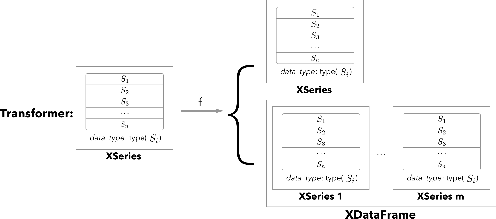

This is a copy-paste from projects `Github <https://github.com/kiraly-group/xpandas>`_.

Introduction
************

XPandas (extended `Pandas <https://pandas.pydata.org/>`_.) implements 1D and 2D data containers for storing type-heterogeneous
tabular data of any type, and encapsulates feature extraction
and transformation modelling in an sklearn-compatible transformer interface.

Description
+++++++++++++

**XPandas** provides universal 1D typed list (`XSeries`) and 2D type-heterogeneous data-frame (`XDataFrame`) containers
and provides an extended sklearn-like transformer classes interfacing said containers.
Transformers can be used for automated feature extraction and map-reduce style transformations but are not limited to it.

`XSeries` is based on `pandas.Series` that can store objects of any type.
Example would be a series of image containers, or a series of `pandas.Series` objects stored as `XSeries`.
`XSeries` can be visualised according to a schema.

`XDataFrame` extends `pandas.DataFrame` by allowing arbitrary object types per column.
It provides the same convenient sub-setting interface and extended abstract access methods.
Each column is internally stored as an `XSeries` container, all of same length.
One example could be a medical data set where each row is a different patient, say, in a hospital.
The columns would correspond to a type-heterogeneous set of features like numbers (age, height, weight, etc.),
categorical (gender, hair color, etc.), images (x-ray pictures), time series (heat beat, lab history),
and other parts of a medical record.
With `XDataFrame` one can store all this information in a single 2D data container instead of a tedious collection of custom nested lists or arrays.

Another advantage of XPandas is the clean interface it provides to ready-to-go machine learning algorithms in
[scikit-learn](scikit-learn.org). The transformers interface can be used to easily convert the types in a `XDataFrame`
to the primitive types with which sklearn can interface, as part of a modelling pipeline.
In the example with patients data, one may want to extract summary features from
each `pandas.Series`, or extract features from each image, say via a fancy deep learning model.

More technically, the implemented `XSeriesTransformer` class allows implementation of transformation defaults
for `XSeries`, similarly `XDataFrameTransformer` implements transforation for `XDataFrame` type objects.
More mathematically `XSeriesTransformer` encapsulates abstract functions of type `XSeries -> XSeries or XDataFrame`,
`XDataFrameTransformer` encaplsulates functions `XDataFrame -> XDataFrame`,
both following the familiar fit/transform/parameters API from sklearn.

XPandas comes with several pre-implemented transformers for the most common non-primitive data types:
